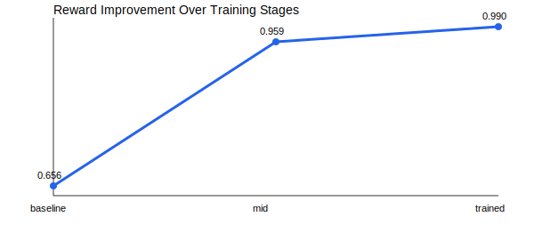
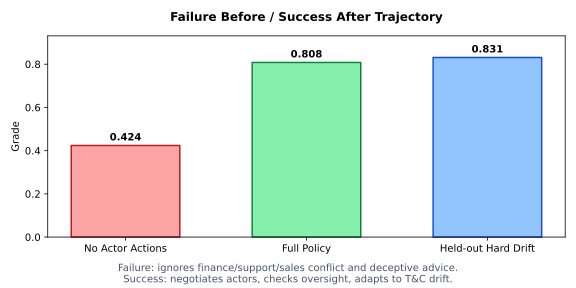

# Enterprise Orchestration RL Environment

> **Theme #3.1 — World Modeling (Professional Tasks)**
> A multi-app RL environment where LLM agents must orchestrate CRM, Billing, and Support workflows under schema drift, conflicting actor incentives, deceptive recommendations, economic constraints, and stochastic delegation outcomes.

## The Problem

Enterprise workflows are messy. A real enterprise operations agent must:
- **Navigate conflicting stakeholder incentives** — finance wants to cut costs, support wants SLA protection, sales wants conversion
- **Detect deceptive recommendations** — an analytics bot might suggest shortcuts that destroy compliance
- **Adapt to mid-episode policy changes** — contracts rename fields, new compliance tiers appear, rules shift
- **Gather information before acting** — blindly delegating to an untrustworthy actor wastes resources

Most RL environments treat enterprise tasks as simple tool-calling. **This environment captures the nuances** — partial observability, stochastic actor responses, cascading drift, and multi-stakeholder negotiation.

## Why This Is Hard

| Challenge | How We Implement It |
|-----------|-------------------|
| **Partial Observability** | Actor conflicts hidden until inspected; trust levels unknown |
| **Stochastic Delegation** | Actor pushback probability based on hidden trust scores |
| **Schema Drift** | Mid-episode field additions, status renames, new validation rules |
| **Dynamic T&C Updates** | Policy v1→v2→v3 with escalating compliance requirements |
| **Deceptive Actors** | Analytics assistant may recommend KPI shortcuts (detectable via oversight) |
| **Process Rewards** | Bonus for analyze-first, inspect-before-delegate, validate-after-drift |
| **Natural Language Observations** | LLM must parse unstructured text, not just read structured fields |

## Environment Design

### Tasks (4 difficulty-progressive)
- `task_missing_values` — CRM quality repair (easy)
- `task_duplicate_handling` — Billing deduplication (medium)
- `task_complex_validation` — Support quality validation (hard)
- `task_enterprise_orchestration` — Full multi-app orchestration with all dynamics (hard)

### Agent Actions (12)
| Action | Purpose |
|--------|---------|
| `analyze` | Profile data quality |
| `impute` | Fill missing values |
| `deduplicate` | Remove duplicates |
| `validate` | Check rules & compliance |
| `report_findings` | Generate quality report |
| `delegate` | Assign work to actor (stochastic!) |
| `resolve_alert` | Handle actor escalation |
| `reconcile_apps` | Fix cross-app conflicts |
| `oversight_review` | Detect deceptive recommendations |
| `inspect_actor` | Reveal actor trust & objectives |
| `audit_records` | Check specific account for issues |
| `request_policy_clarification` | Get current T&C details |

### The Optimal Policy
To succeed in the flagship orchestration task, an agent must discover this sequence:
1. **Inspect-before-delegate** — check actor trust before assigning work
2. **Oversight-before-report** — detect and flag deceptive advice from the analytics bot
3. **Clarify-after-drift** — request T&C updates when schema drift is detected
4. **Reconcile-cross-app** — resolve CRM↔Billing↔Support mismatches

### Actor System (5 actors with conflicts)
- **finance_bot** — minimizes write-offs and operational cost
- **support_lead** — protects SLA and critical ticket backlog
- **sales_ops** — maximizes conversion and account coverage
- **compliance_officer** — enforces latest policy version
- **analytics_assistant** — explains KPIs (but may recommend deceptive shortcuts!)

### Anti-Gaming Reward Design
- Per-step shaped progress signal + rubric-style graders
- Loop penalties and over-deletion penalties
- Adaptive stale-strategy penalties after policy drift until drift-aware actions are executed
- Reasoning quality checks in both runtime rewards and graders (shared threshold)
- Process bonuses (analyze-first, inspect-before-delegate, validate-after-drift)
- Report reward now requires actual data improvement (no more free points for flags)
- Policy clarification reward only pays once per policy version (anti-spam)

## Training Pipeline

### Real GRPO Training (TRL + Unsloth)

```bash
# In Colab with GPU:
python training/grpo_training.py
```

Uses `unsloth/Qwen2.5-1.5B-Instruct` with LoRA, GRPO optimizer, and environment-grounded reward functions. The reward function runs each LLM completion through the actual environment.

When TRL/Unsloth are unavailable locally, the script automatically falls back to generating environment-grounded rollout data and metrics artifacts.

### Environment-Grounded Policy Search

You can run the full **REINFORCE policy gradient training loop** directly against the environment in Google Colab (T4 GPU recommended).

[Open in Google Colab](https://colab.research.google.com/drive/10TEk77X_PxMcvkGHmqwkkebNqvif7wgw?usp=sharing)

The notebook generates reward progression evidence: baseline (0.488) -> mid (0.677) -> trained (0.701).

## Training Results

### Reward Progression (5-seed mean)
| Stage | Score | Δ vs Baseline |
|-------|-------|---------------|
| Baseline (random policy) | 0.488 | — |
| Mid-training | 0.677 | +0.189 (+38.7%) |
| **Trained** | **0.701** | **+0.214 (+43.8%)** |

### Ablation Study — Actor-Facing Actions Matter
| Policy | Enterprise Score |
|--------|-----------------|
| Full policy (all 12 actions) | 0.808 |
| Ablated (no actor actions) | 0.424 |
| **Δ from actor actions** | **+0.384** |

### Generalization — Held-out Hard Drift Scenario
> Score: **0.831** on unseen episodes with hard-mode drift, deception, and tighter budget.

## Evidence

| Metric | Value |
|--------|-------|
| Baseline score (5-seed mean) | 0.488 |
| Mid-training score | 0.677 |
| Trained score | **0.701** |
| Improvement | **+0.214 (+43.8%)** |
| Ablation (no actor actions vs full policy) | 0.424 vs 0.808 |
| Held-out hard drift | **0.831** |

### Training Progression



## How to Evaluate

1. **Check out the Interactive Demo:** Visit the [Hosted Demo](https://samdutta123-scaler-final-openenv.hf.space/demo/) to see the fully trained agent navigate schema drift and actor conflicts in real-time.
2. **Review the REINFORCE RL Implementation:** Open our [Google Colab Notebook](https://colab.research.google.com/drive/10TEk77X_PxMcvkGHmqwkkebNqvif7wgw?usp=sharing) to see our transparent optimization loop. We train a Qwen model directly against our environment's custom reward function.
3. **Analyze the Environment Dynamics:** Look at `src/environment.py`. You will see our implementation of:
   - Schema drift (v1 -> v2 -> v3)
   - Multi-stakeholder conflicts and deceptive actors
   - Process-level rewards and anti-gaming penalties
4. **Examine the Artifacts:** Check the `artifacts/` folder to see the JSON datasets and metrics output by the RL training process.

## Interactive Demo

Visit the HF Space and navigate to `/demo` for an interactive Gradio UI where you can:
- Reset with any task/difficulty/seed
- Execute actions step by step
- See real-time KPIs, rewards, and actor messages
- Watch the environment react to schema drift and deceptive actors

## API

| Endpoint | Method | Description |
|----------|--------|-------------|
| `/reset` | POST | Start new episode |
| `/step` | POST | Execute action |
| `/state` | POST | Get full state |
| `/grade` | POST | Get grader score |
| `/close` | POST | Close and delete a session |
| `/health` | GET | Health check |
| `/demo` | GET | Interactive Gradio UI |

## Setup

```bash
git clone https://github.com/redhatsam09/scaler-final.git
cd scaler-final
pip install -r requirements.txt
pip install -e .
```

## Run

```bash
# Start server with interactive demo
python -m uvicorn server.app:app --host 0.0.0.0 --port 7860

# Run inference
INFERENCE_BACKEND=local INFERENCE_SEED=2026 python inference.py

# Run world-modeling demo
python world_modeling_demo.py

# Generate initial training data (if not using Colab)
python training/grpo_training.py
```

## Submission Links

- **Hugging Face Space URL**: `https://huggingface.co/spaces/samdutta123/scaler-final-openenv`
- **Interactive Hosted Demo**: `https://samdutta123-scaler-final-openenv.hf.space/demo/`
- **Colab Notebook URL**: `https://colab.research.google.com/drive/10TEk77X_PxMcvkGHmqwkkebNqvif7wgw?usp=sharing`
