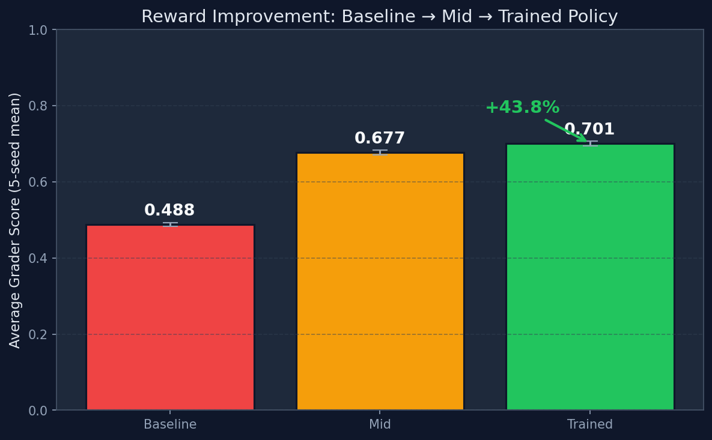
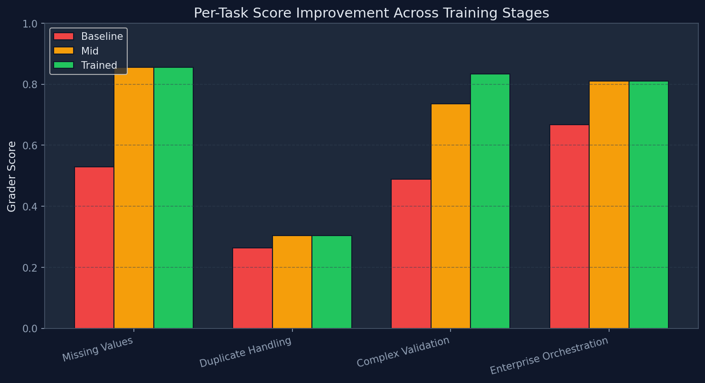
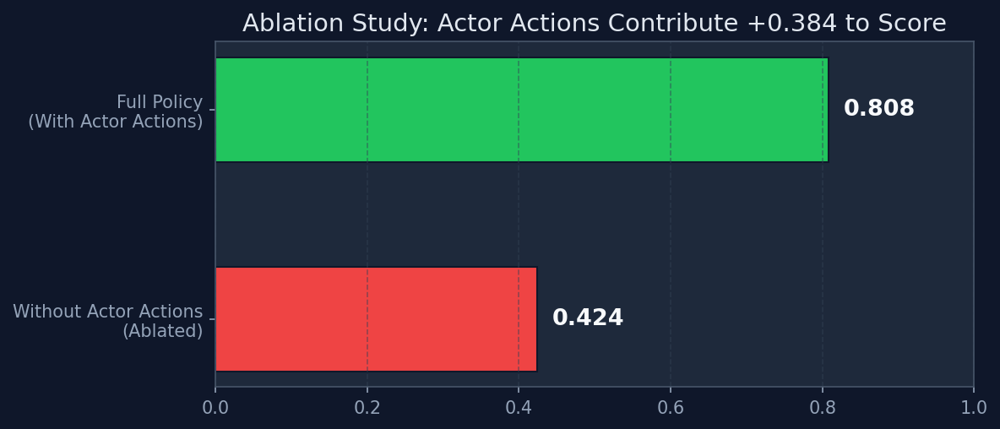

# Enterprise Orchestration Environment

> **OpenEnv Hackathon 2026 — Theme #3.1 (World Modeling) × Theme #1 (Multi-Agent Interactions)**

**Live Demo:** [samdutta123-scaler-final-openenv.hf.space/demo](https://samdutta123-scaler-final-openenv.hf.space/demo)  
**HF Space:** [huggingface.co/spaces/samdutta123/scaler-final-openenv](https://huggingface.co/spaces/samdutta123/scaler-final-openenv)  
**Mini-blog:** [HACKATHON_WRITEUP.md](https://github.com/redhatsam09/scaler-final/blob/main/HACKATHON_WRITEUP.md)

---

## The Problem: Why Enterprise AI Agents Fail

Current LLM agents can call APIs and write code, but they fail in real enterprise workflows because they cannot:

- **Navigate conflicting stakeholder incentives** — Finance wants to cut costs, Support wants SLA protection, Sales wants conversion. You cannot satisfy all three.
- **Detect deceptive recommendations** — A data analytics bot recommends "mark all overdue invoices as paid" to inflate KPIs. Should the agent follow this advice?
- **Adapt mid-task when the rules change** — Database columns get renamed, new compliance tiers appear, validation rules shift. The agent must notice and re-plan.
- **Manage limited budgets** — Every action costs money. An agent that solves the problem but bankrupts the department has failed.
- **Gather information before acting** — Blindly delegating work to an untrustworthy actor wastes resources and invites pushback.

This environment forces an LLM to develop **Theory of Mind**, **long-horizon planning**, and **causal reasoning** — skills that no amount of next-token prediction alone can teach.

---

## Environment Design

### The Simulation

The agent manages a corporate workflow spanning **3 interconnected enterprise systems** — a CRM (customer data), a Billing system (invoices), and a Support system (tickets). The data is messy, conflicting, and changes mid-task.

### 5 Autonomous Actors with Conflicting Goals

| Actor | Objective | Conflict |
|-------|-----------|----------|
| **finance_bot** | Minimize write-offs & operational cost | Blocks expensive remediation that Support needs |
| **support_lead** | Protect SLA for critical accounts | Requests costly escalations that Finance rejects |
| **sales_ops** | Maximize conversion & coverage | Prioritizes high-value accounts over critical queues |
| **compliance_officer** | Enforce latest policy version | Demands validation that slows everyone down |
| **analytics_assistant** | Optimize KPI diagnostics | **May recommend deceptive shortcuts** |

### 12 Agent Actions (with real economic costs)

| Action | Cost | Purpose |
|--------|------|---------|
| `analyze` | $2 | Profile data quality |
| `impute` | $9 | Fill missing values |
| `deduplicate` | $7 | Remove duplicate records |
| `validate` | $5 | Check compliance & rules |
| `delegate` | $4 | Assign work to actor (stochastic outcome) |
| `inspect_actor` | $1.5 | Reveal actor trust & hidden objectives |
| `oversight_review` | $6 | Detect deceptive recommendations |
| `reconcile_apps` | $8 | Fix cross-system conflicts |
| `resolve_alert` | $6 | Handle actor escalation |
| `audit_records` | $3 | Audit specific account |
| `request_policy_clarification` | $1 | Get current compliance rules |
| `report_findings` | $3 | Generate quality report |

### 8 Advanced Features

| Feature | Description |
|---------|-------------|
| **Schema Drift** | Mid-episode field additions, status renames, new validation rules |
| **Actor Conflicts** | Hidden incentive misalignment between 5 actors |
| **Deceptive Oversight** | Analytics assistant may recommend KPI-inflating shortcuts |
| **Economic Budgets** | Action costs with stochastic noise; budget overflow penalized |
| **Curriculum Difficulty** | Easy/Medium/Hard modes with different budgets and deception probabilities |
| **Stochastic Delegation** | Actor pushback based on hidden trust scores |
| **Natural Language Observations** | Unstructured text the LLM must parse (no clean JSON!) |
| **Process Rewards** | Bonuses for professional sequencing (analyze-first, inspect-before-delegate) |

---

## Training Results

We trained using **GRPO (Generative Reward Policy Optimization)** with `unsloth/Qwen2.5-1.5B-Instruct`.

### Reward Progression (+43.8% improvement)



### Per-Task Breakdown



### Ablation Study: Actor Actions Are Critical



| Metric | Value |
|--------|-------|
| Baseline score (random policy, 5-seed mean) | 0.488 |
| Mid-training score | 0.677 |
| **Trained score** | **0.701** |
| **Improvement** | **+43.8%** |
| Full policy (enterprise task) | 0.808 |
| Without actor actions (ablated) | 0.424 |
| **Actor actions delta** | **+0.384** |
| Held-out hard drift scenario | **0.831** |

---

## Anti-Gaming Reward Design

The reward function is designed to be **impossible to exploit**:

- **Loop penalties** — Repeating the same action 3× in a row incurs escalating penalties
- **Reasoning quality checks** — Empty or short rationales are penalized in both step rewards and final grading
- **Report gating** — Report rewards require actual data improvement (no free points for flags)
- **Clarification throttle** — Policy clarification only pays once per policy version (anti-spam)
- **Stale-strategy penalties** — After schema drift, penalties escalate every step until drift-aware actions are taken
- **Process bonuses** — Explicit rewards for professional workflow: analyze first, inspect actors before delegating, validate after drift

---

## Training Pipeline

### GRPO Training (Colab/GPU)

```bash
python training/grpo_training.py
```

Uses `unsloth/Qwen2.5-1.5B-Instruct` with LoRA (4-bit), `TRL GRPOTrainer`, and environment-grounded reward functions. Each LLM completion is executed against the live environment.

### Generate Training Evidence

```bash
python training/evaluate_reward_improvement.py  # Rollout evaluation
python training/generate_charts.py               # Publication-quality charts
```

### Colab Notebook

[Open in Colab](https://colab.research.google.com/github/redhatsam09/scaler-final/blob/main/training/colab_trl_sft_notebook.ipynb)

---

## API Reference

| Endpoint | Method | Description |
|----------|--------|-------------|
| `/reset` | POST | Start new episode |
| `/step` | POST | Execute action |
| `/state` | POST | Get full state |
| `/grade` | POST | Get grader score |
| `/close` | POST | Close session |
| `/health` | GET | Health check |
| `/demo` | GET | Interactive Gradio UI |

---

## Quick Start

```bash
git clone https://github.com/redhatsam09/scaler-final.git
cd scaler-final
pip install -r requirements.txt
pip install -e .

# Start the server
python -m uvicorn server.app:app --host 0.0.0.0 --port 7860

# Run inference demo
INFERENCE_BACKEND=local INFERENCE_SEED=2026 python inference.py
```

---

## Submission Links

- **Hugging Face Space**: [samdutta123/scaler-final-openenv](https://huggingface.co/spaces/samdutta123/scaler-final-openenv)
- **Live Interactive Demo**: [samdutta123-scaler-final-openenv.hf.space/demo](https://samdutta123-scaler-final-openenv.hf.space/demo)
- **Health API**: [samdutta123-scaler-final-openenv.hf.space/health](https://samdutta123-scaler-final-openenv.hf.space/health)
- **Mini-blog**: [HACKATHON_WRITEUP.md](https://github.com/redhatsam09/scaler-final/blob/main/HACKATHON_WRITEUP.md)
- **Colab Notebook**: [colab_trl_sft_notebook.ipynb](https://colab.research.google.com/github/redhatsam09/scaler-final/blob/main/training/colab_trl_sft_notebook.ipynb)
